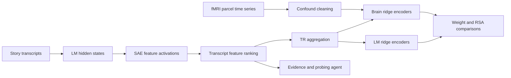

# Thesis Neuro

[](https://github.com/daMS2005/thesis_neuro/actions/workflows/ci.yml)
[](https://www.python.org/)
[](LICENSE)

Research software for studying whether transcript-grounded sparse-autoencoder (SAE) features support similar predictive structure in language models and human fMRI responses. The repository accompanies Daniel Arturo Mora Soler's undergraduate thesis and focuses on the implementation: feature extraction, transcript/TR alignment, ridge encoding models, representational comparisons, and evidence-based feature probing.

The code does **not** bundle participant data, model weights, fMRIPrep derivatives, atlases, or generated results. Those boundaries are deliberate and documented in [Data Contracts](docs/data-contracts.md).

## Research Pipeline



The primary analyses use `shapesphysical` and `shapessocial` story stimuli and support Gemma 2 2B, Gemma 2 9B, and Llama 3.1 8B model configurations. Features are aggregated onto the transcript TR grid; lagged feature windows are used for brain prediction, while LM-side targets are evaluated on matched TR samples. See [Architecture](docs/architecture.md) for component boundaries and [Reproducibility](docs/reproducibility.md) for commands.

## What Is Implemented

- Transcript and Dolma extraction over selected residual-stream SAE layers.
- Feature ranking, counterfactual token/span alignment, and evidence collection.
- An auditable probing runner that stores evidence, tests, steering checks, and reports.
- Raw and confound-cleaned parcel target construction from BIDS/fMRIPrep inputs.
- TR-level feature artifacts, grouped ridge validation, learned-weight comparisons, and RSA summaries.
- An exploratory SuperGLUE benchmark extension using the same selected feature basis.
- A local audit dashboard for reviewing transcript activations and launching targeted probes.

## Repository Map

| Path | Purpose |
| --- | --- |
| `src/thesis_neuro/` | Main package, extraction pipelines, probing, storage, and audit dashboard |
| `structure_comparison/` | Transcript/TR alignment, brain targets, ridge modeling, RSA, and analysis scripts |
| `benchmark_comparison/` | Exploratory behavioral benchmark extension |
| `eda_brain_data/` | Curated OpenNeuro EDA notebooks and general data-preparation scripts |
| `notebooks/` | Methodology and probing-analysis notebooks |
| `configs/` | Portable defaults and example experiment configurations |
| `docs/` | Architecture, data contracts, reproducibility, methodology, results notes, and thesis text |
| `examples/` | Small offline fixtures used for smoke tests and interface validation |
| `tests/` | Deterministic unit and workflow tests |

## Quick Start

Install the lightweight development environment:

```bash
python -m venv .venv
source .venv/bin/activate
python -m pip install -e ".[dev]"
```

Validate the installation without data, network access, or model caches:

```bash
thesis-neuro --config configs/examples/mock.yaml mock-extract
thesis-neuro-benchmark validate-items --items-path examples/benchmark/mock_boolq.jsonl
pytest
python scripts/check_repo_hygiene.py
```

Install every research dependency when running model and brain workflows:

```bash
python -m pip install -e ".[full]"
```

The four packaged interfaces are:

```text
thesis-neuro            extraction, ranking, alignment, and probing
thesis-neuro-audit      local transcript/feature audit dashboard
thesis-neuro-structure  TR artifacts, brain targets, ridge models, and RSA
thesis-neuro-benchmark  exploratory benchmark preparation and comparison
```

## Data And Configuration

Portable defaults live in [`configs/default.yaml`](configs/default.yaml). Paths can be supplied through CLI/config arguments or rooted with:

```bash
export THESIS_NEURO_DATA_ROOT=/path/to/research-data
export THESIS_NEURO_OUTPUT_ROOT=/path/to/generated-outputs
```

Secrets belong in an untracked `.env` file. Copy [`.env.example`](.env.example) and provide only the credentials needed by the command being run. No command requires a credential for `--help`, config validation, mock extraction, or unit tests.

## Scope And Limitations

- Ridge prediction and representational similarity are associational analyses; they do not establish that a feature causally controls a model or a brain response.
- Hemodynamic lags are evaluated through explicit lagged TR design matrices, not inferred as feature-specific causal delays.
- Probe reports summarize transcript and intervention evidence and can still inherit model-judge errors.
- The benchmark track is exploratory. This repository provides its implementation and fixture contract but makes no benchmark-performance claim.
- Full numerical reproduction requires separately authorized OpenNeuro derivatives, atlas files, model/SAE weights, and run manifests.

The preserved thesis text is available at [`docs/thesis/thesis.txt`](docs/thesis/thesis.txt). Citation metadata is in [`CITATION.cff`](CITATION.cff), and release history is in [`CHANGELOG.md`](CHANGELOG.md).
