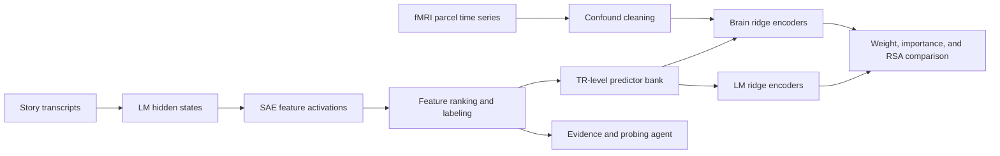

# Thesis Neuro

Research code that asks whether language models and human brains rely on the same interpretable features while processing the same story.

[](https://github.com/daMS2005/thesis_neuro/actions/workflows/ci.yml)
[](https://www.python.org/)
[](LICENSE)

## What This Is

An undergraduate thesis project that compares language models with human fMRI recordings. The pipeline extracts sparse-autoencoder (SAE) features from Gemma 2 and Llama 3.1, grounds them in naturalistic story transcripts, aligns them to the fMRI time grid, and fits matched ridge encoders to cortical responses and to the models' own hidden states. Comparing the two fitted models shows which features matter in each system and how similar their structure is.

The follow-up paper submission lives in its own repository: [A Cross-Description Test of Sparse-Feature Correspondence Between Language Models and fMRI Responses](https://github.com/daMS2005/A-Cross-Description-Test-of-Sparse-Feature-Correspondence-Between-Language-Models-and-fMRI-Responses).

## Highlights

- **End-to-end ML and neuroscience pipeline.** Hugging Face model hooks, `sae-lens` SAE encoding, streaming scans of the Dolma corpus, fMRIPrep confound cleaning with `nilearn`, grouped ridge cross-validation, and representational similarity analysis, all behind one installable package.
- **Three models on one feature basis.** Gemma 2 2B, Gemma 2 9B, and Llama 3.1 8B, with SAE layers chosen at matched relative depths so results compare across architectures.
- **Built for constrained hardware.** Feature analysis works from file-backed JSONL artifacts and can restart from any completed analysis stage with `--from-stage` and `--until-stage`. Models load with `low_cpu_mem_usage` and single-GPU placement, which is what let the 9B checkpoint run on one 24 GB GPU.
- **LLM-in-the-loop interpretability.** A judge model labels features from collected evidence, and a multi-round probing agent tests hypotheses with synthetic probes, transcript edits, and activation steering, storing every step for audit.
- **Local audit dashboard.** A dependency-free HTTP server and vanilla JavaScript front end for browsing transcript activations and launching targeted probes.
- **Engineering hygiene.** Four CLIs that defer heavy imports until a command runs, a portable data-root contract, deterministic offline tests, and CI on Python 3.11 and 3.12 with lint, notebook, link, and secret/data-leak checks.

## Result In Brief

Cleaned `shapesphysical` story, pooled all-layers predictor family, 48 fMRI runs, 200 cortical parcels, three models:

| Model | Brain r | Brain R² | LM r | Feature-importance agreement | Sample RSA |
| --- | ---: | ---: | ---: | ---: | ---: |
| Gemma 2 2B | 0.170 | 0.034 | 0.490 | 0.958 | 0.067 |
| Gemma 2 9B | 0.169 | 0.034 | 0.566 | 0.961 | 0.019 |
| Llama 3.1 8B | 0.170 | 0.035 | 0.622 | 0.909 | 0.050 |

The same transcript-grounded features dominate both the brain and the model fits (importance agreement above 0.9), while moment-by-moment representational geometry is only weakly shared (RSA below 0.1). Larger models are easier to predict internally but do not predict the brain better. Method details and caveats are in [Methods and Results](docs/methods.md).

## How It Works



1. **Discover features from the stories.** Run each transcript through the model, encode residual streams with the SAE, and rank features by how strongly and persistently they respond.
2. **Explain the features.** Collect external contexts from Dolma, ask a judge model for a concept label, and localize each feature to tokens and spans with counterfactual edits.
3. **Build matched predictors.** Aggregate feature activations onto the fMRI repetition-time grid so the same predictor matrix can be fit to both systems.
4. **Fit and compare.** Ridge-regress cleaned brain parcels and held-out model targets from the shared predictors, then compare learned weights, feature importance, and representational geometry.

See [Architecture](docs/architecture.md) for the package layout and [Data Contracts](docs/data-contracts.md) for artifact schemas.

## Quick Start

```bash
python -m venv .venv
source .venv/bin/activate
python -m pip install -e ".[dev]"
make check
```

`make check` runs lint, byte-compilation, tests, notebook and link validation, a data-leak scan, a mock extraction smoke run, and benchmark item validation. None of it needs data, network access, model weights, or credentials. Install `.[full]` for the model, fMRI, judge, notebook, and data-preparation dependencies, then follow the [Usage Guide](docs/usage.md) for real runs.

Four commands are installed:

```text
thesis-neuro            feature extraction, ranking, alignment, and probing
thesis-neuro-audit      local audit dashboard
thesis-neuro-structure  TR artifacts, brain targets, ridge models, and RSA
thesis-neuro-benchmark  exploratory behavioral-benchmark extension
```

Research inputs and generated outputs stay outside the repository and are located through two environment variables:

```bash
export THESIS_NEURO_DATA_ROOT=/path/to/research-data
export THESIS_NEURO_OUTPUT_ROOT=/path/to/generated-outputs
```

## Repository Layout

```text
src/thesis_neuro/           feature extraction, analysis, probing, and the audit dashboard
src/structure_comparison/   transcript/TR alignment, brain targets, ridge models, RSA
src/benchmark_comparison/   exploratory SuperGLUE extension on the same feature basis
scripts/data_prep/          BIDS subset, fMRIPrep audit, and transcript-timing preparation
scripts/analysis/           figure builders and hidden-state analysis variants
scripts/quality/            notebook, link, and data-leak checks used by CI
notebooks/                  brain-data EDA, model-results comparison, probe-run analysis
configs/                    portable defaults and example run configurations
examples/                   tiny offline fixtures for tests and smoke runs
tests/                      deterministic unit and workflow tests
docs/                       architecture, methods and results, data contracts, usage
```

## Tech Stack

Python 3.11+, PyTorch, Transformers, sae-lens, Hugging Face Datasets, NumPy, pandas, nibabel, nilearn, OpenAI API, pytest, Ruff, GitHub Actions.

## License

[MIT](LICENSE).
