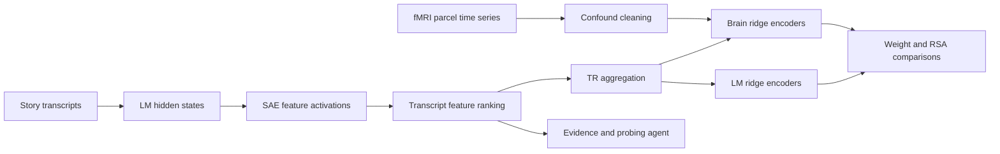

# Thesis Neuro

[](https://github.com/daMS2005/thesis_neuro/actions/workflows/ci.yml)
[](https://www.python.org/)
[](LICENSE)

**Do language models and human brains lean on the same interpretable features while processing the same story?** This repository is the implementation behind Daniel Arturo Mora Soler's undergraduate thesis on that question. It extracts sparse-autoencoder (SAE) features from Gemma 2 and Llama 3.1, grounds them in naturalistic story transcripts, aligns them to the fMRI repetition-time (TR) grid, and fits matched ridge encoders to cortical parcel responses and to language-model targets so that the two fitted structures can be compared directly.

The repository ships code, methodology notes, analysis notebooks, and the thesis text. It does **not** bundle participant data, model weights, fMRIPrep derivatives, atlases, or generated results; those boundaries are deliberate and documented in [Data Contracts](docs/data-contracts.md).

> **Companion repository.** The frozen analysis workflow for the follow-up paper submission lives in [A Cross-Description Test of Sparse-Feature Correspondence Between Language Models and fMRI Responses](https://github.com/daMS2005/A-Cross-Description-Test-of-Sparse-Feature-Correspondence-Between-Language-Models-and-fMRI-Responses). This repository is the thesis implementation that preceded it.

## At A Glance

| | |
| --- | --- |
| **Question** | Whether transcript-grounded SAE features carry similar predictive structure in language models and in human fMRI responses |
| **Models** | Gemma 2 2B, Gemma 2 9B, and Llama 3.1 8B with their Gemma Scope and Llama Scope residual-stream SAEs |
| **Brain data** | OpenNeuro Narratives (`ds002345`), the `shapesphysical` and `shapessocial` stories, Schaefer-200 cortical parcels, fMRIPrep confound cleaning |
| **Method** | Transcript-first feature discovery, Dolma context collection, LLM-judge labeling, a TR-level predictor bank, grouped ridge cross-validation, and weight, importance, and RSA comparisons |
| **Headline** | The same features matter in both systems (feature-importance correlation 0.91 to 0.96) while moment-by-moment geometry is only weakly shared (sample RSA 0.02 to 0.07) |

## Headline Results

Cleaned `shapesphysical` analysis, pooled all-layers predictor family, 48 of 59 runs, 200 parcels, leave-one-run-out brain evaluation, and blocked five-fold LM evaluation. Values are copied from the thesis results section.

| Model | Brain r | Brain R² | LM r | LM R² | Sample RSA | Feature-importance r |
| --- | ---: | ---: | ---: | ---: | ---: | ---: |
| Gemma 2 2B | 0.1700 | 0.0337 | 0.4898 | 0.0209 | 0.0670 | 0.9584 |
| Gemma 2 9B | 0.1693 | 0.0339 | 0.5659 | 0.2022 | 0.0185 | 0.9610 |
| Llama 3.1 8B | 0.1699 | 0.0350 | 0.6217 | 0.3925 | 0.0500 | 0.9086 |

LM-side values for Gemma 2 9B and Llama 3.1 8B use the thesis's provisional hidden-state-style presentation; the Gemma 2 2B row is an exact final-hidden-state rerun.

- **Confound cleaning changed the picture.** The raw `shapessocial` baseline reached higher brain correlations (up to 0.272) but with strongly negative brain R² and a visual and dorsal-attention parcel pattern. The cleaned analysis gives lower but calibrated fits with positive R² and a consistent somatomotor-temporal pattern.
- **Feature salience is shared; geometry mostly is not.** Feature-importance agreement stays above 0.9 for every model while sample-level RSA stays below 0.1. The defensible claim is partial overlap in which features matter, not a shared representational space.
- **Scaling helps the LM side more than the brain side.** Larger models are easier to predict internally, yet all three models tie on brain prediction.

Full tables, single-layer results, and caveats are in [Model Fitting Results](docs/results/model-fitting.md) and the [thesis text](docs/thesis/thesis.md).

## Research Pipeline



Features are aggregated onto the transcript TR grid. Lagged feature windows are used for brain prediction, while LM-side targets are evaluated on matched TR samples. See [Architecture](docs/architecture.md) for component boundaries and [Reproducibility](docs/reproducibility.md) for commands.

## What Is Implemented

- Transcript and Dolma extraction over selected residual-stream SAE layers, with layers chosen at matched relative depths across architectures.
- Feature ranking, counterfactual token and span alignment, and evidence collection.
- An auditable probing runner that stores evidence, tests, steering checks, and reports.
- Raw and confound-cleaned parcel target construction from BIDS and fMRIPrep inputs.
- TR-level feature artifacts, grouped ridge validation, learned-weight comparisons, and RSA summaries.
- An exploratory SuperGLUE benchmark extension using the same selected feature basis.
- A local audit dashboard for reviewing transcript activations and launching targeted probes.

## Engineering Highlights

- **Four packaged CLIs with lazy imports.** `--help`, config validation, and the mock pipeline never import PyTorch or neuroimaging libraries, so the interfaces stay usable on any machine.
- **Portable data contract.** Every input and output resolves through two environment roots. No machine-specific paths, hosts, or cluster wrappers exist in the public tree, and a test enforces that.
- **Offline verification.** A mock extraction pipeline writes the full artifact schema without model weights, so schema tests and downstream readers run in CI without data or network access.
- **Streaming, resume-safe analysis.** The feature-analysis stage processes multi-gigabyte JSONL artifacts incrementally and can restart from any sub-stage, after earlier versions were killed for memory on a 15 GiB VM.
- **Auditable probing.** Each probe run stores its evidence, per-round hypotheses and tests, optional steering checks, and a final report with explicit uncertainty and confidence.
- **Framework-free audit dashboard.** A standard-library HTTP server and a vanilla JavaScript front end for reviewing transcript activations and launching targeted probes.
- **Quality gates on Python 3.11 and 3.12.** Ruff, byte-compilation, pytest, notebook-cleanliness, Markdown-link, and repository-hygiene checks (secrets, machine paths, oversized or binary files) run on every push.

## Repository Map

| Path | Purpose |
| --- | --- |
| `src/thesis_neuro/` | Main package: extraction pipelines, feature analysis, probing, storage, and the audit dashboard |
| `structure_comparison/` | Transcript/TR alignment, brain targets, ridge modeling, RSA, and analysis scripts |
| `benchmark_comparison/` | Exploratory behavioral benchmark extension |
| `eda_brain_data/` | Curated OpenNeuro EDA notebooks and data-preparation scripts |
| `notebooks/` | Methodology and probing-analysis notebooks |
| `configs/` | Portable defaults and example experiment configurations |
| `docs/` | Architecture, data contracts, reproducibility, methodology, results, and thesis text |
| `examples/` | Small offline fixtures used for smoke tests and interface validation |
| `tests/` | Deterministic unit and workflow tests |

## Quick Start

Install the lightweight development environment and run every offline check:

```bash
python -m venv .venv
source .venv/bin/activate
python -m pip install -e ".[dev]"
make check
```

`make check` runs the same lint, compile, test, notebook, link, hygiene, and smoke steps as CI. None of them need data, network access, model caches, or credentials. The individual commands are listed in [Reproducibility](docs/reproducibility.md).

Install every research dependency when running model and brain workflows:

```bash
python -m pip install -e ".[full]"
```

The four packaged interfaces are:

```text
thesis-neuro            extraction, ranking, alignment, and probing
thesis-neuro-audit      local transcript/feature audit dashboard
thesis-neuro-structure  TR artifacts, brain targets, ridge models, and RSA
thesis-neuro-benchmark  exploratory benchmark preparation and comparison
```

## Data And Configuration

Portable defaults live in [`configs/default.yaml`](configs/default.yaml). Paths can be supplied through CLI and config arguments or rooted with:

```bash
export THESIS_NEURO_DATA_ROOT=/path/to/research-data
export THESIS_NEURO_OUTPUT_ROOT=/path/to/generated-outputs
```

Secrets belong in an untracked `.env` file. Copy [`.env.example`](.env.example) and provide only the credentials needed by the command being run. No command requires a credential for `--help`, config validation, mock extraction, or unit tests.

## Documentation

| Document | Contents |
| --- | --- |
| [Architecture](docs/architecture.md) | Scientific flow, code boundaries, and runtime boundaries |
| [Data Contracts](docs/data-contracts.md) | Required fields for transcripts, feature runs, TR bundles, brain bundles, and probe runs |
| [Reproducibility](docs/reproducibility.md) | Installation, path configuration, and the command sequence for each stage |
| [Model Data Collection](docs/methodology/model-data-collection.md) | How SAE features were discovered, contextualized, judged, and aligned for three models |
| [Model Fitting Methodology](docs/methodology/model-fitting.md) | Predictor construction, brain-target cleaning, ridge estimation, and comparison metrics |
| [Model Fitting Results](docs/results/model-fitting.md) | Completed raw and cleaned results with tables and interpretation |
| [Thesis Text](docs/thesis/thesis.md) | Literature review, methodology, results, and references |

## Scope And Limitations

- Ridge prediction and representational similarity are associational analyses; they do not establish that a feature causally controls a model or a brain response.
- Hemodynamic lags are evaluated through explicit lagged TR design matrices, not inferred as feature-specific causal delays.
- Probe reports summarize transcript and intervention evidence and can still inherit model-judge errors.
- The benchmark track is exploratory. This repository provides its implementation and fixture contract but makes no benchmark-performance claim.
- The cleaned results cover 48 of 59 `shapesphysical` runs and are reported as interim findings in the thesis.
- Full numerical reproduction requires separately authorized OpenNeuro derivatives, atlas files, model and SAE weights, and run manifests.

## Citation And License

Released under the [MIT License](LICENSE). Citation metadata is in [`CITATION.cff`](CITATION.cff), and release history is in [`CHANGELOG.md`](CHANGELOG.md).
