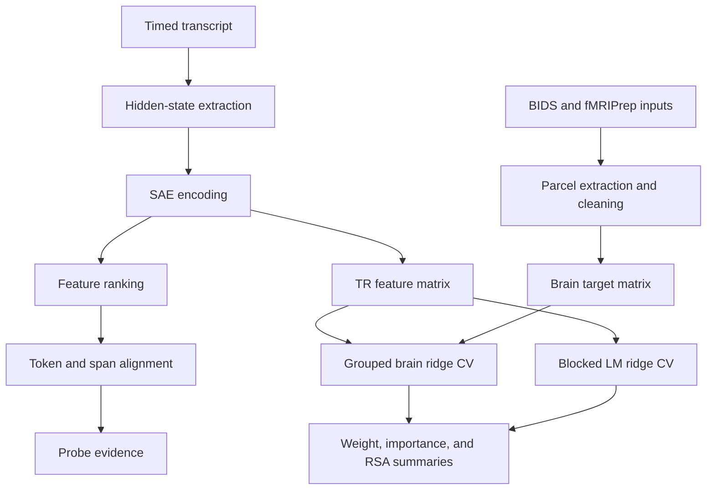

# Architecture

## Scientific Flow

One transcript-derived feature basis is used in two predictive settings. SAE activations are extracted from language-model residual streams, aligned to words, and aggregated into TR bins. The resulting predictors are fit to fMRI parcel responses and to held-out language-model targets, and the fitted models are compared.

## Packages

### `thesis_neuro`

| Module | Role |
| --- | --- |
| `cli.py` | `thesis-neuro` argument parsing and command dispatch |
| `config.py`, `paths.py` | Typed YAML configuration and portable data/output root resolution |
| `models.py`, `sae.py`, `datasets.py` | Hugging Face model adapter, SAE adapter, and Dolma/transcript document sources |
| `pipelines/` | Extraction, transcript discovery, Dolma context collection, counterfactual alignment, mock extraction, and summaries |
| `feature_analysis.py`, `judge.py` | Streaming feature ranking and correlation stages, plus the judge client |
| `probes/` | Dependency-free schemas, evidence access, the probing agent, and the multi-round runner |
| `storage.py` | Append-only JSONL artifact store with manifests |
| `audit_web.py`, `audit_data.py`, `static/` | Threaded HTTP server, view builders, and the HTML/CSS/JS dashboard |

### `structure_comparison`

| Module | Role |
| --- | --- |
| `cli.py` | `thesis-neuro-structure` parser; imports numerical code only after a command is chosen |
| `alignment.py` | Token, word, and TR alignment with model-specific tokenizers and validation |
| `artifacts.py` | TR-level predictor and target bundles, feature-key selection, `.npz` writers |
| `brain.py` | Parcel extraction, confound cleaning, censoring, and brain target bundles |
| `modeling.py` | Ridge fitting, grouped cross-validation, weight collapse, importance and RSA comparisons |
| `workflow.py` | End-to-end structure comparison across predictor families |
| `defaults.py`, `utils.py` | Shared defaults, JSON/JSONL helpers, and array utilities |

### `benchmark_comparison`

Reuses the feature and ridge contracts for an exploratory SuperGLUE analysis: item normalization, answer-choice scoring, feature extraction, and benchmark-side ridge fits compared against registered brain models.

## Runtime Boundaries

The base installation is lightweight. Model, brain, judge, notebook, and development dependencies are opt-in extras. CLI parsing, configuration validation, mock extraction, artifact storage, and unit tests never need model downloads or private data.

Every input and output resolves through `THESIS_NEURO_DATA_ROOT` and `THESIS_NEURO_OUTPUT_ROOT`, or through explicit path arguments. Credentials are read from an untracked `.env` file and redacted from every configuration snapshot the pipeline writes.

## Quality Gates

CI runs on Python 3.11 and 3.12: Ruff, byte-compilation, pytest, a check that notebooks carry no outputs, a local Markdown link check, and a scan that rejects tracked data files, oversized files, credential-like strings, and absolute home paths. `make check` runs the same steps locally.
