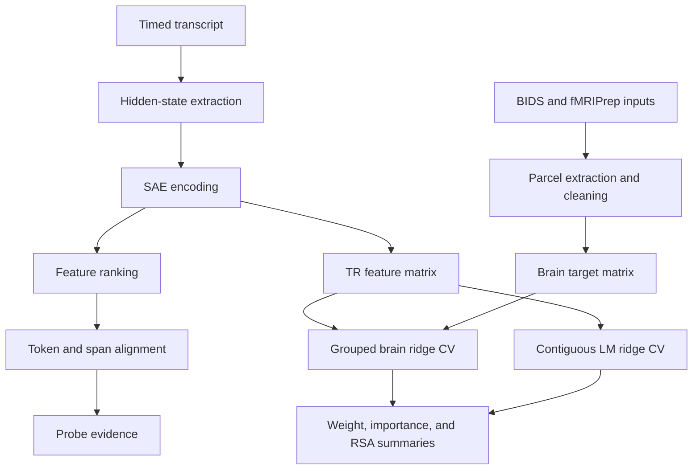

# Architecture

## Scientific Flow

The project uses one transcript-derived feature basis in two predictive settings. SAE activations are extracted from language-model residual streams, aligned to words, and aggregated into TR bins. The resulting features predict either fMRI parcel responses or held-out LM feature targets. Comparisons are made between fitted models, not between unmatched raw activation tensors.

## Code Boundaries

- `thesis_neuro.pipelines` contains extraction, transcript discovery, context collection, alignment, mock extraction, and summary entrypoints. `thesis_neuro.pipeline` remains as a compatibility facade.
- `thesis_neuro.probes` separates dependency-free schemas, evidence access, judge integration, and runner orchestration. `thesis_neuro.probing` remains as a compatibility facade.
- `structure_comparison.alignment` owns token/word/TR interfaces.
- `structure_comparison.brain` exposes parcel-target and confound-cleaning operations.
- `structure_comparison.modeling` exposes ridge validation and representational comparisons.
- `structure_comparison.artifacts` exposes feature bundle construction and storage.
- `structure_comparison.cli` is intentionally lightweight and imports numerical or neuroimaging code only after a command is selected.
- `benchmark_comparison` reuses the feature and ridge contracts for an explicitly exploratory behavioral analysis.

## Runtime Boundaries

The package has a lightweight base installation. Model, brain, judge, notebook, and development dependencies are opt-in extras. CLI parsing, path/config validation, mock extraction, artifact storage, and unit tests do not need model downloads or private data.

The local audit dashboard uses Python's threaded HTTP server. Its server logic is in `audit_web.py`; HTML, CSS, and JavaScript are packaged under `src/thesis_neuro/static/`.

## Compatibility

The original `thesis_neuro.pipeline`, `thesis_neuro.probing`, and `structure_comparison.workflow` import paths remain available for notebooks and historical scripts. New code should use the focused modules above.
